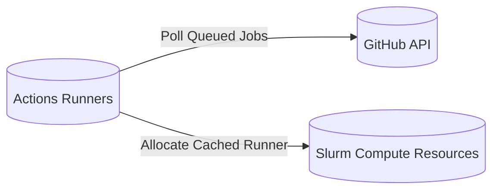

# run-gha-on-slurm

This is still a work in progress. The goal is to run GitHub Actions on the Slurm cluster.

# How it works
1. Polls the GitHub API for queued jobs
2. Whenever a job is queued, it allocates an ephemeral action runner on the Slurm cluster
3. Once the job is complete, the runner and Slurm resources are de-allocated

# Notes
Custom image: https://github.com/WATonomous/actions-runner-image

# TODO
- Use docker and custom image for actions runner
- Make sure the image is cached 
- Set up custom cpu/mem for different sized jobs
	- What should these be based off of? https://github.com/WATonomous/infra-config/blob/b604376f4ee9fa3336b11dc084ba90b962ec7ee1/kubernetes/github-arc/get-config.py#L120-L142 
- Use secrets for the token
- Get access token
- Use for more repos
	- modify to get the repo name dynamically
- Need to track if the runner for a job has been allocated
- Look into security of passing tokens to scripts
- Testing

# Issue
- Rerun jobs aren't picked up

# Potential issue:
- job1 requires label1, label2
- job2 requires label1
- runner1 is allocated with label1, label2
- runner1 runs job2
- runner2 is allocated with label1
- runner2 CANT RUN job1
Won't be an issue if we use one label (small, medium, large) per job
