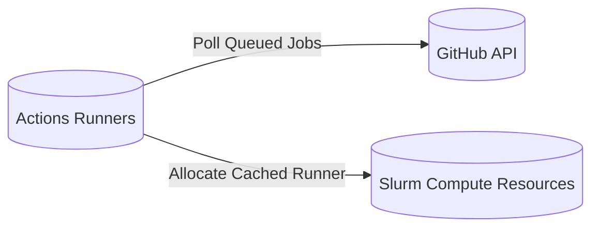
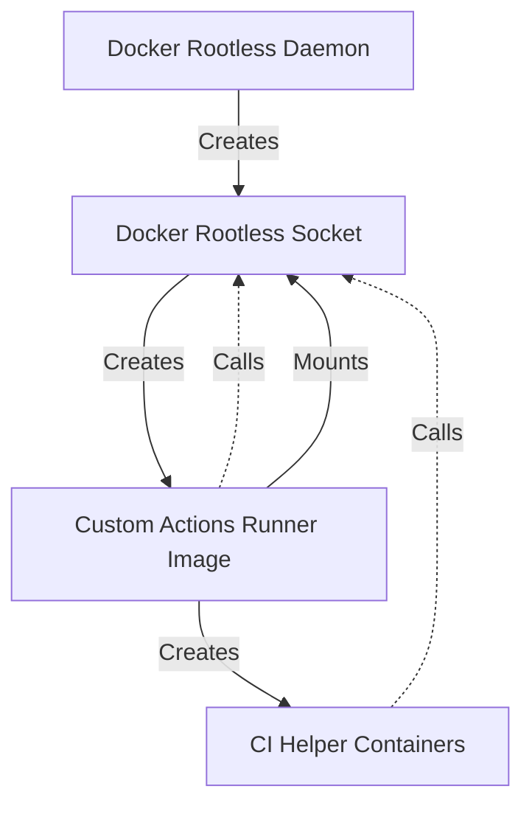

# run-gha-on-slurm

This is still a work in progress. The goal is to run GitHub Actions on the Slurm cluster.

# Overview
## How it works
1. Polls the GitHub API for queued jobs
2. Whenever a job is queued, it allocates an ephemeral action runner on the Slurm cluster
3. Once the job is complete, the runner and Slurm resources are de-allocated

## Basic diagram of the system

## Enabling Docker Within CI Jobs

Since CI Docker commands will use the same filesystem, as they have the same Docker socket, you need to configure the working directory of your runners accordingly. 

### Docker References
1. [Docker Rootless](https://docs.docker.com/engine/security/rootless/)
2. [Custom Actions Runner Image](https://github.com/WATonomous/actions-runner-image)

# Issues
- If script needs to be restart and runners are being built, the script will allocate new runners once its back up 

# Potential issue:
- job1 requires label1, label2
- job2 requires label1
- runner1 is allocated with label1, label2
- runner1 runs job2
- runner2 is allocated with label1
- runner2 CANT RUN job1
Won't be an issue if we use one label (small, medium, large) per job

