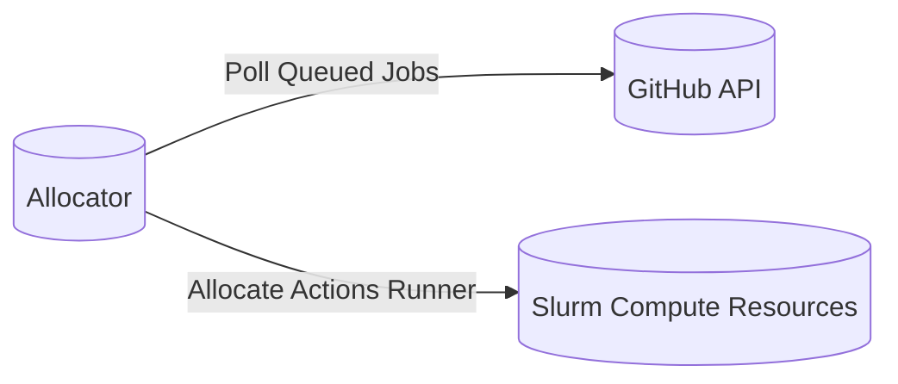

# run-gha-on-slurm

The purpose of this project is to run GitHub Actions on prem via our Slurm cluster.

# Overview
1. The Allocator polls the GitHub API for queued jobs
2. Whenever a job is queued, it allocates an ephemeral action runner on the Slurm cluster
3. Once the job is complete, the runner and Slurm resources are de-allocated

### Basic diagram of the system

