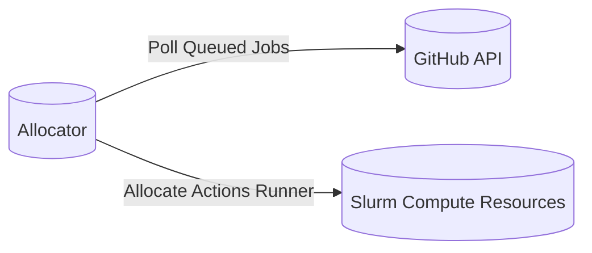
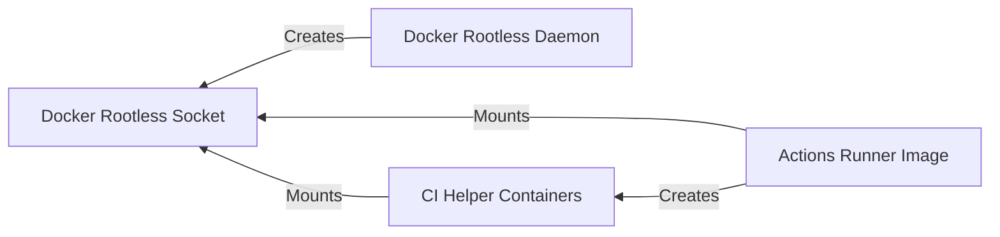
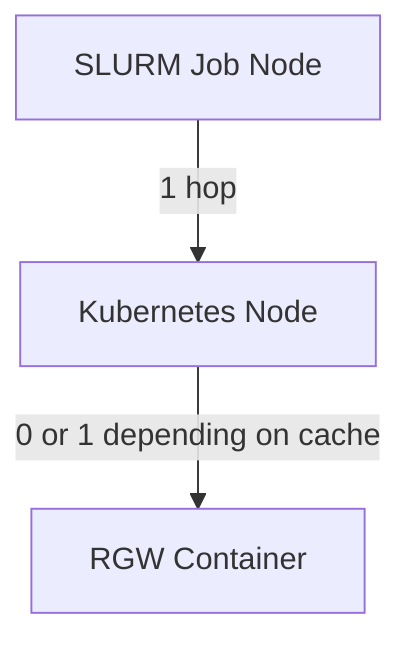
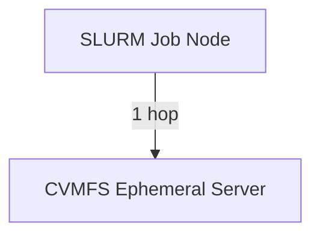

# run-gha-on-slurm

The purpose of this project is to run GitHub Actions on prem via our Slurm cluster.

# Overview
1. The Allocator polls the GitHub API for queued jobs
2. Whenever a job is queued, it allocates an ephemeral action runner on the Slurm cluster
3. Once the job is complete, the runner and Slurm resources are de-allocated

### Basic diagram of the system

## Enabling Docker Within CI Jobs

We run our CI jobs with a container, [actions-runner-image](https://github.com/WATonomous/actions-runner-image). Within these jobs we also run containers, thus we needed to run Docker within Docker.

Normally it would be a security risk to mount the Docker socket into a container, but since we are using [Docker Rootless](https://docs.docker.com/engine/security/rootless/), we are able to mitigate this risk.

> **Note:** The CI's Docker commands will use the same filesystem, as they have the same Docker socket, you must configure the working directory of your runners accordingly. In our case this meant place the working directory in the ephemeral storage, via the `/tmp`, folder within a Slurm job.

## Speeding up the start time for our Actions Runner Image

After we were able to run the actions runner image in as Slurm job using [sbatch](https://slurm.schedmd.com/sbatch.html) and custom script we ran into the issue of having to pull the actions runner image for every job. From the time the script allocated resources to the time the job began was ~ 2 minutes. When you are running 70+ jobs in a workflow, with jobs depending on others, this time adds up quickly.

Unfortunately, caching the image in our filesystem was not an elegant solution because this would require mounting the filesystem directory to the Slurm job. This means we would need to have multiple directories if we wanted to support multiple concurrent runners. This would require creating a system to manage these directories and would introduce problems such as starvation and dead locks. 

This led us to investigate several options:
- [Docker pull through cache](https://docs.docker.com/docker-hub/mirror/)
- [Stargz Snapshotter](https://github.com/containerd/stargz-snapshotter)
- [Apptainer](https://apptainer.org/docs/user/main/index.html)

We decided to go with Apptainer as it was the most straightforward solution. Apptainer is a tool that allows you to create a snapshot of a container image and store it in a tarball. This tarball can be loaded into the containerd runtime and used as a cache. This allows us to pull the image once (per machine) and use it for all subsequent jobs. 

## CVMFS ephermal for caching our Provisioner image

For many of our jobs we use a container we call the provisioner. This container is a tool that is used to provision a service. This container is large, over 1.5GB, and needs to be rebuilt with every CI run. This new container is then used to run the subsequent dependent jobs. 

### Previous Solution
Previously after the provisioner was built, we would cache in S3, via [rgw](https://docs.ceph.com/en/latest/man/8/radosgw/), within our Kubernetes cluster. This worked well as we previously ran [actions-runner-controller](https://github.com/actions/actions-runner-controller) within the same cluster. Previously, it would only take 1 hop when there was a cache miss. Now that we are running the actions runner on our Slurm cluster, it would take at least 1 hop, 2 when there was a cache miss. 

### New Idea
We decided to leverage a (CVMFS ephemeral server)[https://github.com/WATonomous/cvmfs-ephemeral/] to be used for hosting ephemeral files such as our provisioner image. In this setup, the provisioner image is cached in a CVMFS repository hosted on a high-performance node in the kubernetes cluster. By avoiding the Kubernetes RGW cache, which is deployed on a separate less performant node, we can reduce the time it takes to pull the provisioner image.

## Deployment to Kubernetes

We deployed this on our self hosted Kubernetes, via the docker image in this repo. To communicate with the GitHub API, an access token is needed. For our use case a [personal access token](https://docs.github.com/en/authentication/keeping-your-account-and-data-secure/managing-your-personal-access-tokens#about-personal-access-tokens) which provides 5000 requests per hour was sufficient. This was deployed as a Kubernetes environment variable. 

To enable communication with the Slurm controller we set up a [munge key](https://dun.github.io/munge/). The Python script is then able to allocate an actions runner by triggering a bash script run with `sbatch`.

## Tracking Metrics

## Next Steps

### References
1. [Docker Rootless](https://docs.docker.com/engine/security/rootless/)
2. [Custom Actions Runner Image](https://github.com/WATonomous/actions-runner-image)
3. [Apptainer](https://apptainer.org/docs/user/main/index.html)
4. [Stargz Snapshotter](https://github.com/containerd/stargz-snapshotter)
5. [CVMFS](https://cvmfs.readthedocs.io/en/stable/)
6. [CVMFS Stratum 0](https://github.com/WATonomous/cvmfs-ephemeral/)

# Issues
- If script needs to be restart and runners are being built, the script will allocate new runners once its back up 

# Potential issue:
- job1 requires label1, label2
- job2 requires label1
- runner1 is allocated with label1, label2
- runner1 runs job2
- runner2 is allocated with label1
- runner2 CANT RUN job1
Won't be an issue if we use one label (small, medium, large) per job

